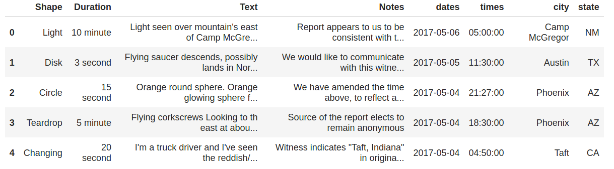

# NLP Unsupervised Learning Case Study

<a href="https://github.com/cwong690">Cindy Wong</a> | <a href="https://github.com/oro13">Feli Gentle</a> | <a href="https://github.com/mkpetterson">Maureen Petterson</a>

## Table of Contents

## Introduction

UFO sightings occur with relative frequency all across the United States. The sighted UFOs have various shapes and the sightings last for varying amounts of time. Using the UFO sighting database, we evaluated several characteristics of the sightings and used Natural Language Processing (NLP) to analyze the descriptions and see what commonalities all the descriptions had. 

The data was pulled from the [The National UFO Reporting Center Online Database](http://www.nuforc.org/webreports.html).  

## Data Preparation and Exploratory Data Analysis

### Data Preparation

The raw data was 2.5GB and required a decent amount of preparation prior to analysis. We downloaded a zipped json file that included the raw HTML for each individual sighting. Cleaning and preparation methods included:

- Extracting the unique observation ID, date, time, location, shape and text description of the sightings
    - First we used Beautiful Soup's html parser to extract data contained within specific HTML tags
    - Regular expressions were utilized to extract the exact terms we needed to run analyis on the different features
- Separating the text description from the follow-up notes
- Putting the information into a pandas datafram for easier analysis

    
Raw JSON data

    

    

    
Raw Extracted Sample Report

    

    
    
The cleaned up pandas dataframe is shown below
    
  

### Exploratory Data Analysis

    
Name

    
Name

    
Name

    <td></td>

## Natural Language Processing
The data was analyzed using a combination of nltk packages and sklearns CountVectorizer/TFIDFVectorizer to analysis the most common words within the observations. We also used topic modeling to extract latent features of the text. The pipeline used on each observation was:

1. Tokenization of text observations 
2. Stop Words removal (standard English)
3. Lemmitization using nltk WordNetLemmatizer
4. TFIDFVectorizer to get the relative word strength
5. Topic Modeling using Non-negative Matrix Factorization (NMF)

Using this pipeline allowed us to visualize the most common words for the observations. 

<b>UFO Sightings</b>

<b>Notes on the UFO Sightings</b>

<b>Bigfoot Sightings</b>

## Summary and Key Findings

