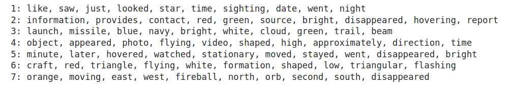
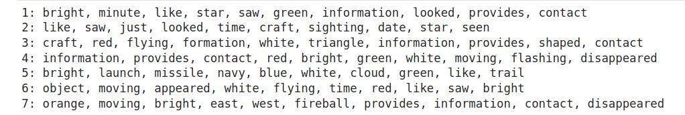

# NLP Unsupervised Learning Case Study

<a href="https://github.com/cwong690">Cindy Wong</a> | <a href="https://github.com/oro13">Feli Gentle</a> | <a href="https://github.com/mkpetterson">Maureen Petterson</a>

## Table of Contents

- <a href="https://github.com/mkpetterson/UFO_sightings#Introduction">Introduction</a> 
- <a href="https://github.com/mkpetterson/UFO_sightings#data-preparation-exploratory-data-analysis">Exploratory Data Analysis and Data Preparation</a> 

- <a href="https://github.com/mkpetterson/UFO_sightings#natural-language-processing">Natural Language Processing</a> 
- <a href="https://github.com/mkpetterson/UFO_sightings#summary-and-key-findings">Summary and Key Findings</a>

## Introduction

UFO sightings occur with relative frequency all across the United States. The sighted UFOs have various shapes and the sightings last for varying amounts of time. Using the UFO sighting database, we evaluated several characteristics of the sightings and used Natural Language Processing (NLP) to analyze the descriptions and see what commonalities all the descriptions had. 

The data was pulled from the [The National UFO Reporting Center Online Database](http://www.nuforc.org/webreports.html).  

## Data Preparation and Exploratory Data Analysis

### Data Preparation

The raw data was 2.5GB and required a decent amount of preparation prior to analysis. We downloaded a zipped json file that included the raw HTML for each individual sighting.

Cleaning and preparation methods included:

- Extracting the unique observation ID, date, time, location, shape and text description of the sightings
    - First we used Beautiful Soup's html parser to extract data contained within specific HTML tags
    - Limited data to about 15,000 in order for it to not run forever
    - Regular expressions were utilized to extract the exact terms we needed to run analyis on the different features
- Separating the text description from the follow-up notes
- Putting the information into a pandas datafram for easier analysis

    
Raw JSON data

    

    

    
Raw Extracted Sample Report

    

    
    
     
    
The cleaned up pandas dataframe is shown below
    
  

### Exploratory Data Analysis

The sightings described the UFOs as various different shapes, including circles, chevrons, lights, or fireballs. The duration of the sightings lasted from a few seconds to many minutes. 

**Shapes and Duration**  

The time of day for the observations were also interesting. Sightings tended to be higher in the early morning or evening hours, which makes sense as UFO lights will not be as visible during daylight hours. It's also possible many people mistake planets, satellites, or planes as UFOs.  

**State**

We got a count of the states and sightings. It seems California is number one for UFO sightings.

## Natural Language Processing
The data was analyzed using a combination of nltk packages and sklearn CountVectorizer/TFIDFVectorizer to analyze the most common words within the observations. The output of the TFIDF transformation was deconstructed using two methods: 
1. Non-Negative Matrix Factorization (NMF) 
2. Singular Value Decomposition (SVD) combined with Kmeans 

Both of these methods allowed extraction of latent topics.  

The corpus (documents) was prepared using standard methods:
- Tokenization
- Stop words removal (standard English)
- Lemmatization using nltk WordNetLemmatizer
- TFIDF Vectorization to get the relative word strengh

The results from the NMF and SVD+kmeans are shown below. 

NMF topics: 

SVD + kmeans topics: 

## Summary and Key Findings

